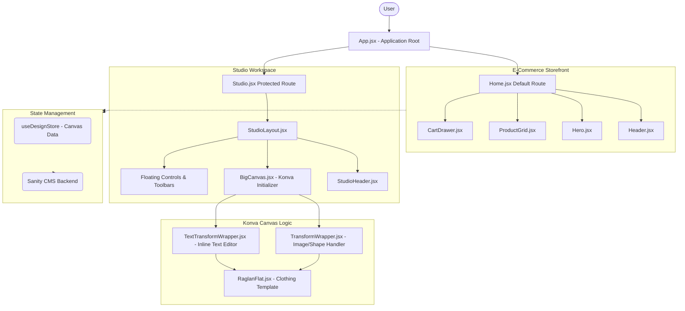

# D-max Developer Guide

*Last Updated: April 16, 2026, 11:03 AM*

Welcome to the **D-max** project! This guide explains the core purpose, architecture, and design philosophy of the application. It breaks down the system structure visually and walks through our folder hierarchy to help any new developer immediately feel at home.

---

## Overview

D-max is a premium web application bridging an e-commerce storefront with a powerful, interactive design studio. Users can browse products and enter an intuitive drag-and-drop canvas to creatively customize their own designs (e.g., clothing mockups). 

Built with heavy emphasis on high-end luxury aesthetics, glassmorphism, precise drop shadows, and smooth physics-based animations, the application mimics a tactile, high-fashion workspace.

---

## Technology Stack

Our foundation relies on robust, modern tooling:
- **Framework:** React 19 & Vite 
- **Global State:** Zustand (`useDesignStore.js`) and React Context API
- **Graphics/Canvas:** `konva` and `react-konva` for the core interactive Studio
- **Animations:** Framer Motion for spring-based physics (driving our "liquid glass" UI)
- **CMS/Backend:** Sanity CMS via `@sanity/client`
- **Styling:** Vanilla CSS with a focus on CSS variables for consistent luxury themes

---

## System Architecture Diagram

The application is strictly divided into two distinct experiences: the browsing **Storefront** and the interactive **Studio**.



---

## Folder Structure & File Manifest

Below is the layout of the `src/` directory. Organizing by feature and concern ensures the app scales properly.

### High-Level Map

```text
src/
├── components/          # Reusable UI components
│   ├── studio/          # Core interactive design features
│   ├── CartDrawer.jsx   # E-commerce sliding cart logic
│   ├── Header.jsx       # Standard app navigation
│   ├── Hero.jsx         # Landing page hero section
│   └── ProductGrid.jsx  # Storefront layout grid
├── context/             # React Context Providers for UI state
├── data/                # Static configurations and mocks
├── pages/               # Top-level Route components
├── services/            # API setup and external integrations
├── store/               # Global persistent state
└── utils/               # Reusable mathematical/formatting utilities
```

### Deep Dive: `src/components/studio/`

This heavily specialized directory houses everything needed to draw, animate, and manipulate the interactive design canvas.

| File / Component | Purpose |
|------------------|---------|
| **`BigCanvas.jsx`** | The main Konva Stage. Renders the lightened grid background and initializes the drag-and-drop workspace boundaries. |
| **`RaglanFlat.jsx`** | An SVG/Konva representation of a clothing template. Users apply their artwork over this asset. |
| **`TransformWrapper.jsx`** | An invisible bounding box that wraps standard shapes/images, injecting drag handles, rotation logic, and dynamic scaling. |
| **`TextTransformWrapper.jsx`** | A highly specialized wrapper for text elements. Enables seamless *inline text editing* by automatically resizing the boundary as the user types right on the canvas. |
| **`FloatingAddButton.jsx`** | The main UI hub to add text, shapes, or images. Powered by spring animations to feel weighty, expanding like "liquid glass". |
| **`FloatingToolbar.jsx`** | A contextual dock that appears when an element is selected (controls deletion, duplication, layering). |
| **`StudioHeader.jsx`** | The overhead navigation inside the workspace, housing the project title and the "Order Sample" CTA. |
| **`ColorPicker.jsx`** | The palette system allowing dynamic restyling of selected layers. |

### Supporting Modules

#### `src/store/`
- **`useDesignStore.js`**: The central nervous system of the canvas. Uses Zustand to maintain a detailed array of all "nodes" currently painted on the screen (tracking properties like IDs, X/Y coordinates, scale, and text values).

#### `src/services/`
- **`sanity.js`**: Connects the frontend to your Sanity CMS. Handles querying products and assets from the backend.

#### `src/context/`
- **`CartContext.jsx`**: Handles the storefront shopping cart state (adding elements, incrementing quantities).
- **`StudioContext.jsx`**: Manages transient UI behavior within the studio, such as knowing which tool is actively selected or which modals are open.

#### `src/pages/`
- **`Home.jsx`**: The aggregator for all Storefront components.
- **`Studio.jsx`**: The aggregator for the fully-immersive Canvas tool route.

#### `src/utils/` & `src/data/`
- **`colorUtils.js`**: Helper pipelines for parsing HEX/RGB data.
- **`studioAssets.js`**: Core static configurations mapping initial starter data for the studio tools.

---

## Current State of the App

As of now, the application features a deeply robust frontend prototype that correctly balances heavy application state with smooth visuals:
- The router correctly splits the standard E-Commerce side and the Studio environment.
- The Studio environment has advanced interaction functionality, specifically via inline text editing wrappers that correctly resize alongside custom user inputs.
- High-end aesthetics, physics-based animations (like the bottom navigation dock), and luxury brand typography have been successfully integrated. 

## Where the App is Heading 

The foundation is built securely. Moving forward, the development focus scales towards backend data integrity and final production tools:
1. **Expanding the Catalog:** Supplying more dynamic garment bases via Sanity strings.
2. **User Authentication & Cloud Saves:** Linking `useDesignStore.js` logic to unique user profiles so that progress can be saved cross-session.
3. **Advanced Image Upload:** Building a secure pipeline to let users upload their own JPG/PNGs onto the `BigCanvas` layer via the Sanity asset pipeline.
4. **Checkout Integration:** Linking the frontend Cart functionality and the `Order Sample` studio flow to a true gateway (like Stripe).
5. **Print-Ready Exportation:** Wrapping the completed Konva stage in an export pipeline (`html2canvas` -> PDF) to deliver printable files directly to the manufacturing pipeline.
